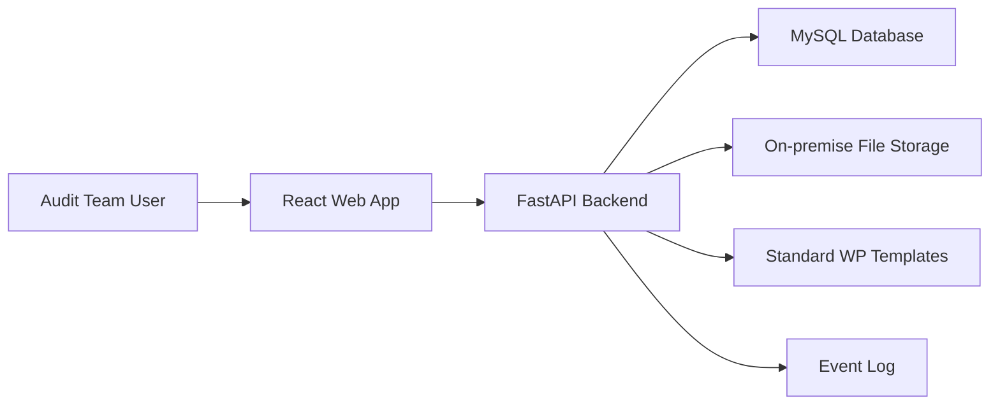
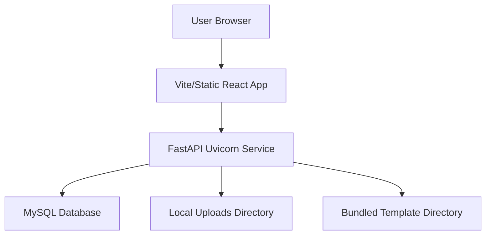

# Specentra AMS - High Level Design

## 1. Purpose

Specentra AMS is an on-premise Audit File Management System for CA firms. The application provides a structured digital audit file explorer with standard engagement folders, working paper indexing, file upload/versioning, review notes, signoffs, closure checks, and role-based access.

The current product stage focuses on audit file organization and compliance-ready workflows. The architecture is also prepared for future AI agent workflows through an event log.

## 2. Goals

- Replace unmanaged network-drive audit folders with a controlled audit-file system.
- Create a standard audit folder structure for every engagement.
- Support audit working paper numbering and manual override by permitted senior users.
- Preserve preparer and reviewer signoffs, including manual initials such as `Client`.
- Provide soft-delete and retention-oriented behavior.
- Keep files on-premise.
- Support roll-forward of engagement folder structures.
- Provide searchable working papers and closure checklist status.

## 3. System Context

## 4. Technology Stack

| Layer | Technology |
|---|---|
| Frontend | React, Vite, React Router, Zustand, Axios |
| Backend | Python, FastAPI, SQLAlchemy |
| Database | MySQL through PyMySQL |
| Auth | JWT bearer token, bcrypt password hashing |
| File storage | Server filesystem |
| Build/runtime | Node.js frontend, Python backend |

## 5. Major Modules

### 5.1 Frontend

- Login and authentication state.
- Dashboard and engagement list.
- Engagement detail file explorer.
- Folder creation and WP upload modals.
- WP detail panel for metadata, versions, notes, signoffs, and downloads.
- User management for Admin.
- Search and closure checklist screens.

### 5.2 Backend API

- Authentication and current-user lookup.
- User management and assignment.
- Engagement creation, listing, archive, reopen, roll-forward.
- Standard audit-file folder structure and template library support.
- Folder tree creation and retrieval.
- Working paper upload, download, replacement, metadata update, notes, signoff.
- Search, event log, and closure checklist.

### 5.3 Database

The database stores users, engagements, sections, folders, working papers, file versions, notes, signoffs, assignments, login logs, and event logs.

### 5.4 File Storage

Uploaded engagement files are stored on disk under the configured `FILE_STORAGE_PATH`, grouped by engagement. File metadata is stored in MySQL.

### 5.5 Standard Templates

Standard 1000-series and 2000-series templates are bundled under `backend/app/templates/audit` as source material. Engagements are created with the standard folder structure only; client-specific WPs appear only when uploaded for that engagement.

## 6. Standard Audit File Structure

Every engagement uses the standard top-level structure:

| Section | Name |
|---|---|
| 1000 | Preconditions for audit |
| 2000 | Audit Planning |
| 3000 | Communications |
| 4000 | Audit Execution |
| 5000 | Audit Reporting |
| MISC | Checklists, Other Misc Documents |

Important standard folders:

- 1000: `SA 200 WPs`, `SA 210 WPs`, `SA 220 WPs`, `SA 240 WPs`, `SA 250 WPs`
- 2000: `Audit planning templates`, `Questionnaires`, `Subsequent period PL`
- 4000: `Assets`, `Equity`, `Expenditure`, `Liabilities`, `Misc`, `Revenue`
- 5000: `Financial statements`, `Notes to accounts`, `Audit reports`, `Tax audit statements`

## 7. Core Workflows

### 7.1 Login

1. User enters email and password.
2. Backend verifies bcrypt password.
3. Backend records login log.
4. Backend returns JWT and user profile including role and initials.
5. Frontend stores token and user state.

### 7.2 Engagement Creation

1. Audit Manager, Partner, or Admin creates engagement.
2. Backend creates engagement record.
3. Backend creates standard sections.
4. Backend creates standard folder structure.
5. Backend keeps bundled standard templates available as source material, but does not create them as engagement WPs.
6. Partners and creator are assigned.
7. Event is recorded.

### 7.3 Folder and WP Numbering

Folders and WPs receive an audit index. Top-level numeric sections generate indexes like `1001`, `2001`, `4001`. Nested items generate indexes like `1001.01`.

Manual index override is allowed only for Audit Manager, Partner, and Admin.

### 7.4 WP Upload

1. User selects a target folder.
2. Backend validates file extension and size.
3. Backend assigns or validates WP index.
4. Backend stores file on disk.
5. Backend creates `WorkingPaper` and initial `FileVersion`.
6. Backend records preparer identity and initials.
7. Event is recorded.

### 7.5 Review and Signoff

- Preparer signoff is recorded as initials.
- Reviewer 1 and Reviewer 2 signoffs are supported.
- Reviewer signoff can be Manager, Partner, EQCR Reviewer, or Admin.
- Signoff can be linked to login or manually entered as metadata.

### 7.6 Roll-forward

1. Manager or Partner starts roll-forward from a prior engagement.
2. Backend creates new engagement and sections.
3. Backend copies folder structure without copying files.
4. Event is recorded.

### 7.7 Closure and Archive

1. Partner opens closure checklist.
2. Backend evaluates checklist items.
3. Archive is blocked if open notes exist or checklist requirements fail.
4. If allowed, status becomes `Archived`.

## 8. Roles

| Role | Typical Access |
|---|---|
| Articled Assistant | Upload WPs, submit for review |
| Audit Executive | Upload WPs, submit, raise/close notes |
| Audit Manager | Create engagements, override indexes, review/finalise |
| Partner | Create, archive, reopen, review/finalise |
| EQCR Reviewer | Review and raise notes, reviewer signoff |
| Admin | User management and administrative actions |

## 9. Security Design

- JWT bearer authentication.
- Passwords are stored as bcrypt hashes.
- Role checks are enforced on backend dependencies and route handlers.
- Inactive users cannot log in.
- File access is through authenticated download endpoints.
- On-premise file storage avoids sending files to external services.

## 10. Compliance Design

- Soft delete for WPs and folders.
- Prepared-by and reviewer attribution retained.
- Event log records important audit actions.
- Standard audit sections and folders promote consistency.
- Closure checklist prevents premature archive.
- Files are retained on server storage.

## 11. Deployment View

For production on Windows Server, the frontend can be served from `frontend-build/dist` through IIS or nginx, while FastAPI runs as a service using Uvicorn.

## 12. Current Limitations

- Tables are created and lightly updated at startup; a formal Alembic migration workflow should be added for production.
- Provided 1000/2000 sample templates are kept as a template library; 3000/4000/5000 do not have standardized WP templates.
- File retention policy is represented in design and soft-delete behavior, but long-term retention enforcement jobs are not yet implemented.
- No full-text file-content indexing is implemented yet.
- AI agent workflows are planned but not active in this stage.

## 13. Future Enhancements

- Formal database migrations.
- Full audit trail screen with filters.
- Template version management.
- Content extraction and document search.
- Configurable firm-specific audit templates.
- AI agent integration using event log.
- Approval workflow for manual index overrides.
