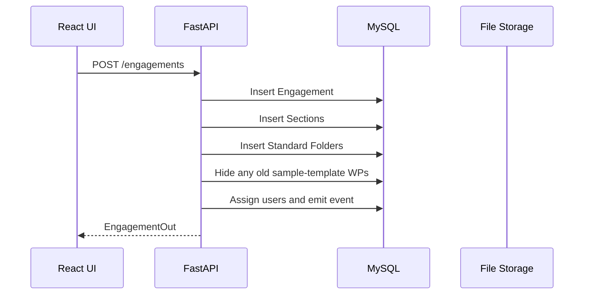
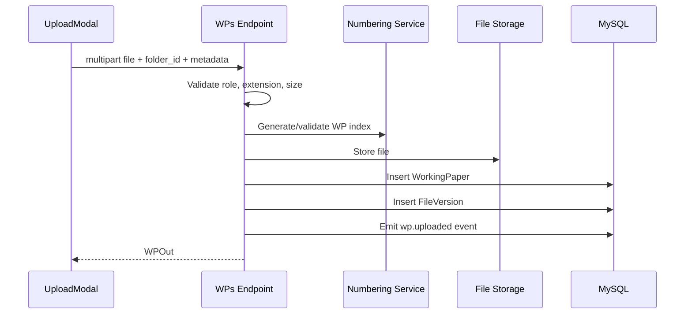
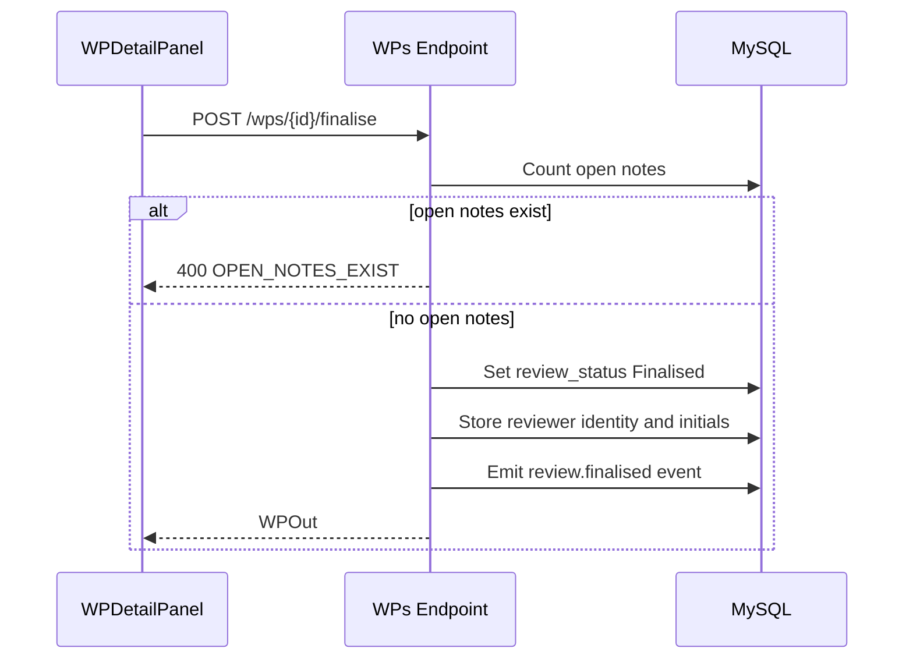

# Specentra AMS - Low Level Design

## 1. Codebase Layout

```text
specentra/
  backend/
    main.py
    app/
      api/v1/endpoints/
      core/
      models/
      schemas/
      services/
      templates/audit/
  frontend-build/
    src/
      api/
      store/
      pages/
      components/
      utils/
```

## 2. Backend Entry Point

File: `backend/main.py`

Responsibilities:

- Create SQLAlchemy tables.
- Apply lightweight schema updates for newly added nullable columns.
- Create upload directory.
- Configure FastAPI, CORS, exception handler, and routes.
- Seed default Admin and Partner users.
- Backfill active engagements with standard sections and folders.

Startup backfill calls `create_standard_audit_file()` for active engagements. Existing sample-template WPs previously seeded into engagements are hidden so each client engagement shows only its own uploaded files.

## 3. Backend Configuration

File: `backend/app/core/config.py`

Important settings:

- `DATABASE_URL`
- `SECRET_KEY`
- `ACCESS_TOKEN_EXPIRE_MINUTES`
- `FILE_STORAGE_PATH`
- `MAX_FILE_SIZE_MB`
- `ALLOWED_ORIGINS`
- `RETENTION_YEARS`

Standard sections:

| Code | Name |
|---|---|
| 1000 | Preconditions for audit |
| 2000 | Audit Planning |
| 3000 | Communications |
| 4000 | Audit Execution |
| 5000 | Audit Reporting |
| MISC | Checklists, Other Misc Documents |

## 4. Database Models

File: `backend/app/models/models.py`

### 4.1 User

Stores login identity and role.

Key fields:

- `user_id`
- `full_name`
- `initials`
- `email`
- `hashed_password`
- `role`
- `is_active`
- `must_change_password`
- `last_login_at`

### 4.2 Engagement

Represents an audit engagement.

Key fields:

- `engagement_id`
- `client_name`
- `financial_year`
- `engagement_type`
- `status`
- `is_eqcr_designated`
- `prior_year_engagement_id`
- archive/reopen metadata

### 4.3 Section

Represents top-level audit series.

Key fields:

- `section_id`
- `engagement_id`
- `section_code`
- `section_name`

### 4.4 Folder

Represents an audit-file folder node.

Key fields:

- `folder_id`
- `engagement_id`
- `section_id`
- `parent_folder_id`
- `folder_name`
- `depth`
- `full_path`
- `wp_number`
- `is_deleted`

### 4.5 WorkingPaper

Represents a file stored inside a folder.

Key fields:

- `wp_id`
- `engagement_id`
- `section_id`
- `folder_id`
- `wp_number`
- `filename`
- `file_format`
- `file_size_bytes`
- `file_storage_path`
- `review_status`
- `prepared_by`
- `prepared_by_name`
- `prepared_by_initials`
- `reviewer1_initials`
- `reviewer2_initials`
- `current_version`
- `is_deleted`

### 4.6 FileVersion

Tracks file version history.

Key fields:

- `version_id`
- `wp_id`
- `version_number`
- `filename`
- `file_size_bytes`
- `file_storage_path`
- `uploaded_by`
- `uploaded_by_name`
- `comment`

### 4.7 ReviewNote

Stores review notes raised against WPs.

Key fields:

- `note_id`
- `wp_id`
- `engagement_id`
- `note_text`
- `status`
- raised/closed metadata

### 4.8 SignOff

Stores explicit signoff events.

Key fields:

- `signoff_id`
- `wp_id`
- `signoff_type`
- `user_id`
- `user_name`
- `initials`
- `role`
- `signed_at`

### 4.9 EventLog

Stores application events for audit trail and future AI workflows.

Key fields:

- `event_id`
- `event_type`
- `timestamp`
- `actor_id`
- `actor_name`
- `engagement_id`
- `payload`

## 5. API Routing

Base prefix: `/api/v1`

Router file: `backend/app/api/v1/router.py`

Included endpoint modules:

- `auth`
- `users`
- `engagements`
- `folders`
- `wps`
- `search`

## 6. API Endpoints

### 6.1 Auth

File: `backend/app/api/v1/endpoints/auth.py`

| Method | Path | Description |
|---|---|---|
| POST | `/auth/login` | Validate credentials, log login, return JWT |
| POST | `/auth/logout` | Stateless logout response |
| GET | `/auth/me` | Return current user |
| POST | `/auth/change-password` | Change password after verifying current password |

### 6.2 Users

File: `backend/app/api/v1/endpoints/users.py`

| Method | Path | Description |
|---|---|---|
| GET | `/users` | List users |
| POST | `/users` | Create user with generated temp password |
| PATCH | `/users/{user_id}/deactivate` | Deactivate user |
| POST | `/users/{engagement_id}/assign` | Assign user to engagement |

User creation derives initials when not supplied.

### 6.3 Engagements

File: `backend/app/api/v1/endpoints/engagements.py`

| Method | Path | Description |
|---|---|---|
| GET | `/engagements` | List accessible engagements |
| POST | `/engagements` | Create engagement, sections, standard folders, templates |
| GET | `/engagements/{engagement_id}` | Get engagement details and sections |
| PATCH | `/engagements/{engagement_id}/archive` | Archive engagement |
| PATCH | `/engagements/{engagement_id}/reopen` | Reopen archived engagement |
| POST | `/engagements/{engagement_id}/rollforward` | Create next-year engagement and copy folder structure |

### 6.4 Folders

File: `backend/app/api/v1/endpoints/folders.py`

| Method | Path | Description |
|---|---|---|
| GET | `/engagements/{engagement_id}/folders` | Return full section/folder/WP tree |
| POST | `/engagements/{engagement_id}/folders` | Create folder with generated or overridden index |
| PATCH | `/folders/{folder_id}` | Rename folder or change index |
| DELETE | `/folders/{folder_id}` | Soft-delete empty folder |

Manual folder index override roles:

- Audit Manager
- Partner
- Admin

### 6.5 Working Papers

File: `backend/app/api/v1/endpoints/wps.py`

| Method | Path | Description |
|---|---|---|
| GET | `/engagements/{engagement_id}/wps` | List WPs |
| POST | `/engagements/{engagement_id}/wps` | Upload WP |
| GET | `/wps/{wp_id}/download` | Download current WP |
| POST | `/wps/{wp_id}/replace` | Upload new version |
| GET | `/wps/{wp_id}/versions` | List versions |
| GET | `/wps/{wp_id}/versions/{version_number}/download` | Download version |
| PATCH | `/wps/{wp_id}` | Update filename, index, signoff initials |
| DELETE | `/wps/{wp_id}` | Soft delete WP |
| POST | `/wps/{wp_id}/submit` | Submit for review |
| POST | `/wps/{wp_id}/finalise` | Finalise WP |
| GET | `/wps/{wp_id}/notes` | Get notes |
| POST | `/wps/{wp_id}/notes` | Raise note |
| PATCH | `/notes/{note_id}/close` | Close note |
| POST | `/wps/{wp_id}/signoff` | Record signoff |

Manual WP index override roles:

- Audit Manager
- Partner
- Admin

Reviewer signoff roles:

- Audit Manager
- Partner
- EQCR Reviewer
- Admin

### 6.6 Search and Closure

File: `backend/app/api/v1/endpoints/search.py`

| Method | Path | Description |
|---|---|---|
| GET | `/search` | Search engagements and WPs |
| GET | `/engagements/{engagement_id}/closure-checklist` | Compute closure checklist |
| GET | `/engagements/{engagement_id}/events` | Return engagement event log |

## 7. Services

### 7.1 Numbering Service

File: `backend/app/services/numbering.py`

Responsibilities:

- Generate top-level indexes like `1001`, `2001`, `4001`.
- Generate child indexes like `1001.01`.
- Detect conflicts across folders and WPs in the same engagement.
- Support non-numeric sections such as `MISC`.

Important functions:

- `assign_wp_number()`
- `get_next_level1_number()`
- `get_next_child_number()`
- `check_wp_number_conflict()`

### 7.2 Audit File Template Service

File: `backend/app/services/audit_file_templates.py`

Responsibilities:

- Create standard folders for every engagement.
- Keep 1000-series templates available as bundled source files.
- Keep 2000-series templates available as bundled source files.
- Create only the standard engagement folder structure by default.

Bundled source path:

```text
backend/app/templates/audit/
  1000/
  2000/
```

Important function:

- `create_standard_audit_file()`

### 7.3 Initials Service

File: `backend/app/services/initials.py`

Responsibilities:

- Derive initials from full names.
- Preserve explicit initials when provided.
- Support examples like `Abhish PJ -> APJ`.

### 7.4 Events Service

File: `backend/app/services/events.py`

Responsibilities:

- Validate event type.
- Create `EventLog` rows for important operations.

## 8. Standard Template Library Detail

### 8.1 1000 Series

Standard folders:

- `SA 200 WPs`
- `SA 210 WPs`
- `SA 220 WPs`
- `SA 240 WPs`
- `SA 250 WPs`

Template files are stored in the app as source material:

```text
backend/app/templates/audit/1000
```

The service recursively creates subfolders found in the template source, such as independence checklist folders and questionnaire folders.

### 8.2 2000 Series

Standard folder:

- `Audit planning templates`

The available Excel templates from the sample zip are stored in the backend template library. They are not automatically copied into client engagements as WPs.

### 8.3 4000 Series

Standard folders:

- `Assets`
- `Equity`
- `Expenditure`
- `Liabilities`
- `Misc`
- `Revenue`

No standard files are seeded because 4000-series WPs are client-specific audit execution workings.

### 8.4 3000 and 5000 Series

Standard sections exist, but no files are seeded because communications, financial statements, reports, and tax audit statements are client-specific.

## 9. Frontend Design

### 9.1 Routing

File: `frontend-build/src/App.jsx`

Routes:

| Path | Component |
|---|---|
| `/login` | `LoginPage` |
| `/` | `DashboardPage` |
| `/engagements` | `EngagementsPage` |
| `/engagements/:id` | `EngagementDetailPage` |
| `/search` | `SearchPage` |
| `/users` | `UsersPage` |

Protected routes require authenticated Zustand state.

### 9.2 API Client

File: `frontend-build/src/api/index.js`

Axios attaches JWT from `localStorage` to each request. A `401` response clears the token and redirects to login.

API groups:

- `authApi`
- `engApi`
- `folderApi`
- `wpApi`
- `userApi`
- `searchApi`

### 9.3 State Management

File: `frontend-build/src/store/index.js`

Stores:

- `useAuthStore`: token, current user, auth status
- `useAppStore`: current engagement and refresh triggers

Role permissions are represented in `ROLE_PERMISSIONS`.

### 9.4 Important Components

| Component | Responsibility |
|---|---|
| `Sidebar` | Main navigation, active engagement, user logout |
| `EngagementDetailPage` | File explorer tree and activity log |
| `CreateFolderModal` | Folder name/index creation |
| `UploadModal` | File upload, index override, signoff initials |
| `WPDetailPanel` | WP metadata, notes, versions, downloads, signoff |
| `ClosureChecklistModal` | Closure checklist and archive action |
| `RollForwardModal` | New-year roll-forward |

## 10. Key Workflows

### 10.1 Create Engagement



### 10.2 Upload WP



### 10.3 Finalise WP



## 11. Validation Rules

### 11.1 File Upload

- File extension must be in `ALLOWED_EXTENSIONS`.
- File size must be less than configured max.
- Folder must exist.
- Archived engagements cannot accept uploads.
- EQCR Reviewer cannot upload or replace WPs.

### 11.2 Folder Delete

- Folder must exist and not be deleted.
- Folder can be deleted only if it contains no active WPs.
- Delete is soft delete.

### 11.3 Index Override

- Only Audit Manager, Partner, and Admin can override folder/WP indexes.
- Duplicate indexes are rejected within the same engagement across folders and WPs.

### 11.4 Archive

- Only Partner can archive.
- Open review notes block archive.
- Closure checklist is used to guide readiness.

## 12. Error Handling

FastAPI routes raise `HTTPException` with structured details:

```json
{
  "error": "Message",
  "code": "ERROR_CODE"
}
```

The frontend uses `getErrorMessage()` to display error messages through toast notifications.

## 13. File Storage Detail

Uploaded files are stored under:

```text
{FILE_STORAGE_PATH}/{engagement_id}/
```

When manually uploaded later, files are stored under:

```text
{FILE_STORAGE_PATH}/{engagement_id}/templates/
```

The database stores the final `file_storage_path`, file size, and format.

## 14. Build and Run

Backend:

```powershell
cd backend
python -m uvicorn main:app --host 0.0.0.0 --port 8000 --reload
```

Frontend:

```powershell
cd frontend-build
npm.cmd run dev
```

Production frontend build:

```powershell
cd frontend-build
npm.cmd run build
```

## 15. Known Technical Debt

- Replace startup schema patching with Alembic migrations.
- Add integration tests for folder skeleton creation and numbering.
- Add background retention/archival jobs.
- Add content extraction for searchable document text.
- Add configurable template management UI.
- Add stronger audit trail filters and export.
